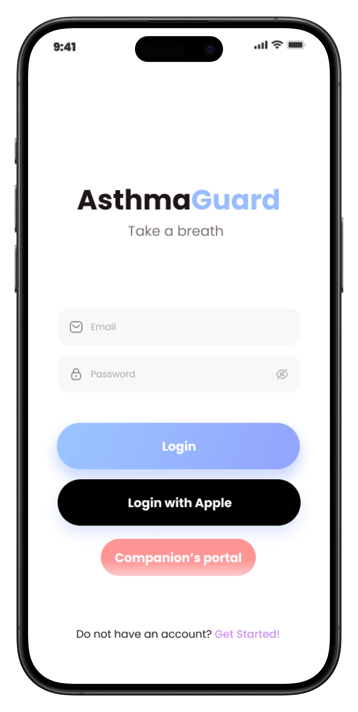
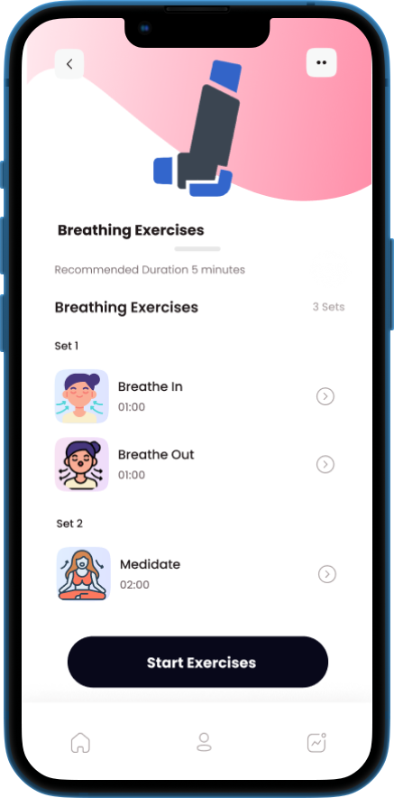
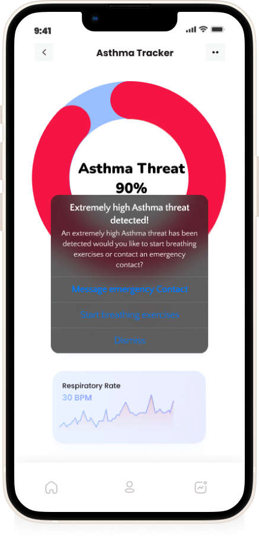
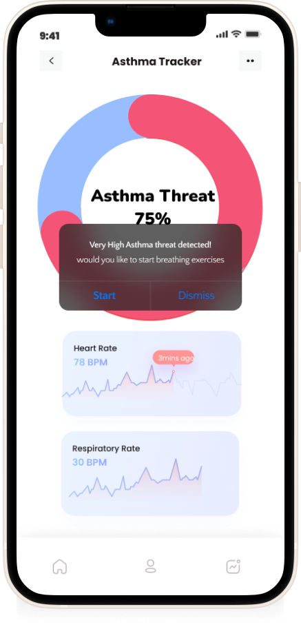

AsthmaGuard, revolutionizes asthma detection and management through advanced algorithms based on predictive analysis of the expert system derived from data science and sensor data derived from smart watches.
AsthmaGuard encompasses native iOS mobile development using Swift and SwiftUI, database management with SQL, the utilisation of APIs for web data extraction, extraction of dynamic data from smartwatches using embedded systems and internet of things concepts, and using Python for the data science engineering and artificial intelligence aspects of the research.
AsthmaGuard is a comprehensive solution aiming to predict asthma attacks by continuously monitoring vital signs crucial for asthmatic patients' health assessment and relevant data such as weather data, medical history, and previous triggers of asthma attacks. 
AsthmaGuard is designed to assist asthmatic patients, by providing personalized asthma risk assessments, insights into triggers, and timely alerts, enhancing proactive asthma management. 

    

    
        

    
    

