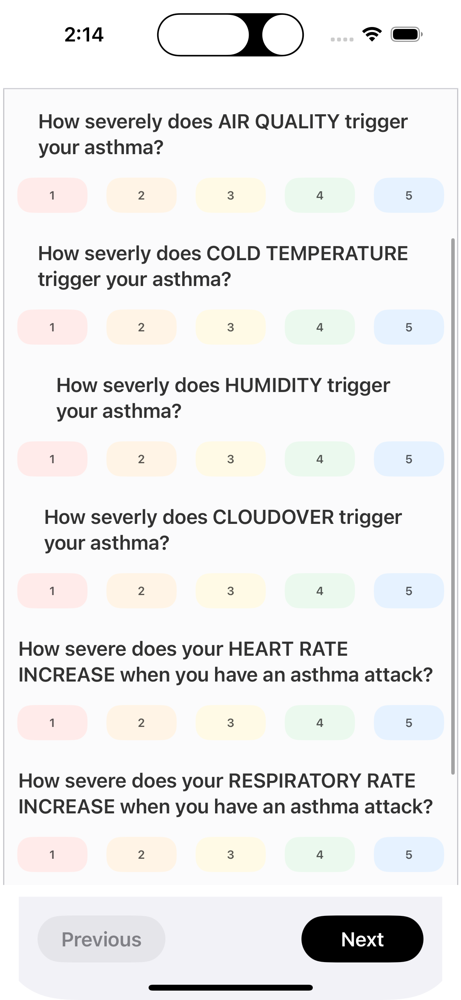

## AsthmaGuard: Asthma Prediction and Management System

##### AsthmaGuard is an asthma detection and management mobile application that predicts asthma attacks using algorithms based on  environmental data and biosignals and vital signs data extracted and processed from the Apple Watch to provide personalized asthma risk assessments and alerts.

### Features

Asthma Prediction: Custom algorithm analyzing environmental and biosignal data.

Real-Time Monitoring: Integrates with smartwatches to collect data like heart rate and respiratory rate.

Personalized Alerts: Notifies users about potential asthma risks based on changes in data.

Breathing Exercises: Includes guided breathing exercises for asthma relief.

### Screenshots

  

    
    
Asthma Threat Dashboard

  

  

    
    
High Asthma Threat Alert

  

  

    
    
User Survey for Environmental Monitoring

  

  
  

    
    
Asthma Threat Breakdown

  

  

    
    
Historical Data Overview

  

  
  

    
    
Breathing Exercises

  

  

### Technologies

iOS Development: Swift and SwiftUI

Database: SQLite

APIs: Apple HealthKit, WatchKit, WeatherKit
